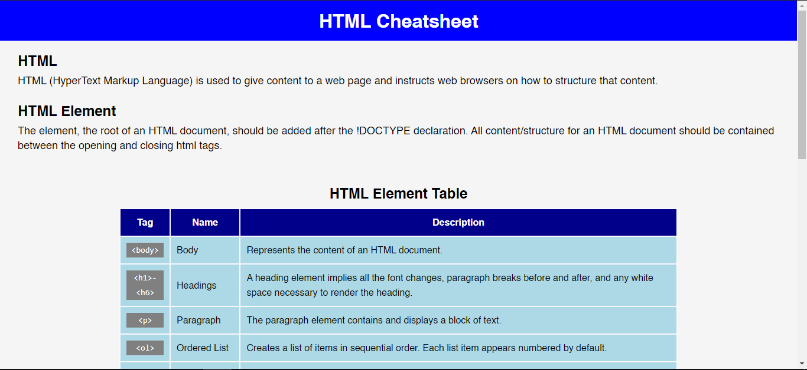
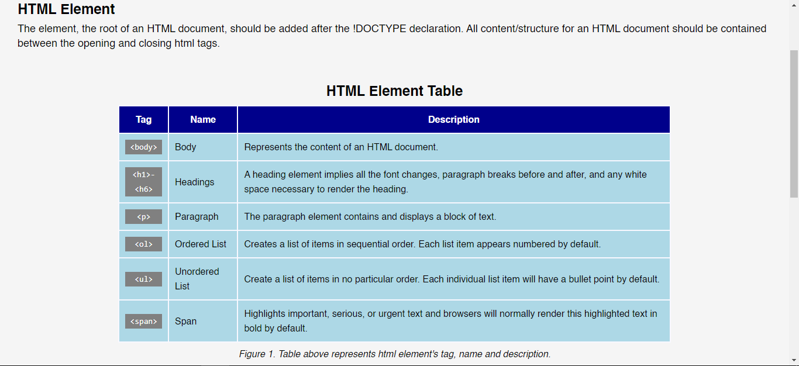
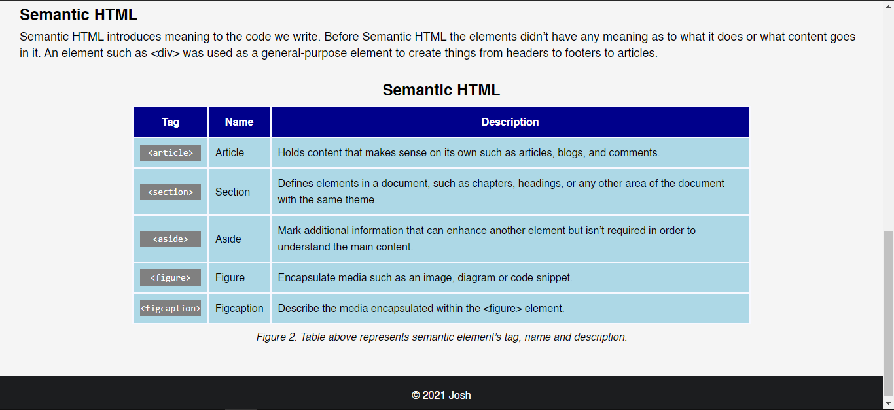

# HTML CheatSheet

## Table of contents

- [General Info](#general-information)
- [Screenshots](#screenshots)
- [Technologies](#technologies)
- [Setup](#setup)

## General Info

Webpage for HTML Cheatsheet.

## Screenshots

## Technologies

Project is created with

- HTML5
- CSS3

## Setup

To run the site you need to install VSCode and Live Server Extension.

## Status

**Note:** This is not yet publish.
